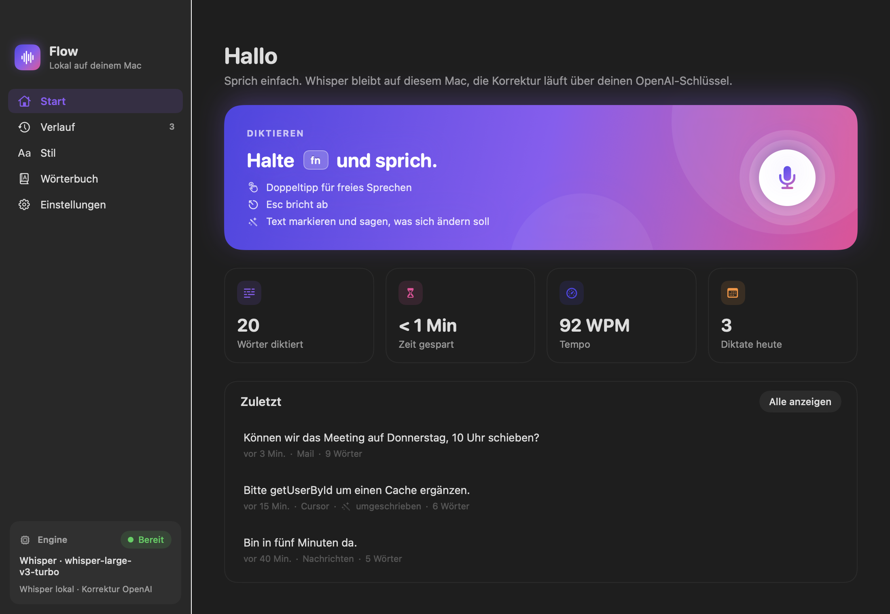

# Flow

Diktat für die Menüleiste auf dem Mac. Die Sprache bleibt auf dem Gerät. Eine Korrektur über OpenAI ist optional und nutzt den eigenen Schlüssel.

**Autor: Sinthex**

Quelltext: <https://github.com/beeXperts-Niko/flow>  
Projektseite: <https://sinthex.de/flow/>



## Was Flow tut

- Aufnahme über die Fn-Taste, Doppeltipp für freies Sprechen, Esc bricht ab.
- Erkennung mit Whisper lokal auf Apple Silicon. Audio verlässt den Mac dafür nicht.
- Optional Korrektur mit dem eigenen OpenAI-Schlüssel. Der Schlüssel liegt im Schlüsselbund, nicht in einer Konfigurationsdatei und nicht in diesem Repository.
- Das Korrekturmodell wird über den Schlüssel ermittelt. Flow empfiehlt das neueste schnelle Modell, ein anderes lässt sich fest einstellen.
- Der Stil richtet sich nach dem vorderen Programm, zum Beispiel Coding in einer Entwicklungsumgebung und E-Mail in Mail. Pro Programm lässt sich der Stil ändern.
- Der Text wird in das aktive Feld eingesetzt. Markierten Text kann man ansagen und umformulieren lassen.

Flow ist eine Menüleisten-App für macOS 14 oder neuer, auf Apple Silicon.

## Lizenz

Flow steht unter der [MIT-Lizenz](LICENSE).

Copyright (c) 2026 Sinthex.

Das bedeutet: Du darfst Flow nutzen, verändern und weitergeben, auch in eigenen Produkten. Bedingung ist, dass der Copyright-Hinweis und der Lizenztext erhalten bleiben. Es gibt keine Gewährleistung. Der vollständige Text steht in [LICENSE](LICENSE).

Flow baut auf anderen Open-Source-Projekten auf, vor allem mlx-whisper, MLX, mlx-vlm und den Whisper-Modellgewichten von OpenAI. Deren Lizenzen gelten zusätzlich und sind in [THIRD_PARTY_NOTICES.md](THIRD_PARTY_NOTICES.md) abgedruckt.

## Privatsphäre

Es gehören keine API-Schlüssel, Zertifikate, PKCS#12-Dateien oder Diktate in dieses Repository. Der OpenAI-Schlüssel bleibt im macOS-Schlüsselbund (`de.dietergeschaeft.Flow` / `openai-api-key`). Konfiguration und Verlauf liegen lokal unter `~/Library/Application Support/Flow/` und sind von Git ausgeschlossen.

## Bauen

Voraussetzungen: macOS 14, Apple Silicon, Xcode-Kommandozeilenwerkzeuge, [uv](https://docs.astral.sh/uv/) und Python 3.12.

```bash
./scripts/install.sh
```

Das Skript legt eine virtuelle Umgebung unter `~/Library/Application Support/Flow/.venv` an, installiert die Engine, lädt die Whisper-Gewichte und baut `Flow.app`.

Die lokale Codesign-Identität bleibt über Updates stabil, damit Mikrofon- und Bedienungshilfe-Freigaben nicht jedes Mal neu verlangt werden. Das Passwort für das lokale Zertifikat liegt außerhalb des Repositorys, in `~/Library/Application Support/Flow/signing/password` oder in der Umgebungsvariable `FLOW_SIGNING_PASSWORD`.

Die Engine allein:

```bash
uv pip install --python ~/Library/Application\ Support/Flow/.venv/bin/python ./engine
```

Sie hört auf `127.0.0.1:17321`.
